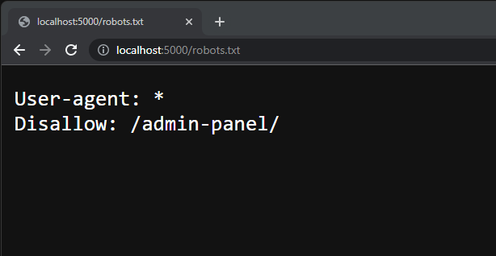
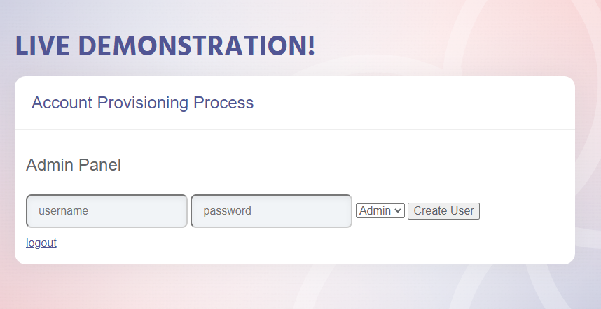
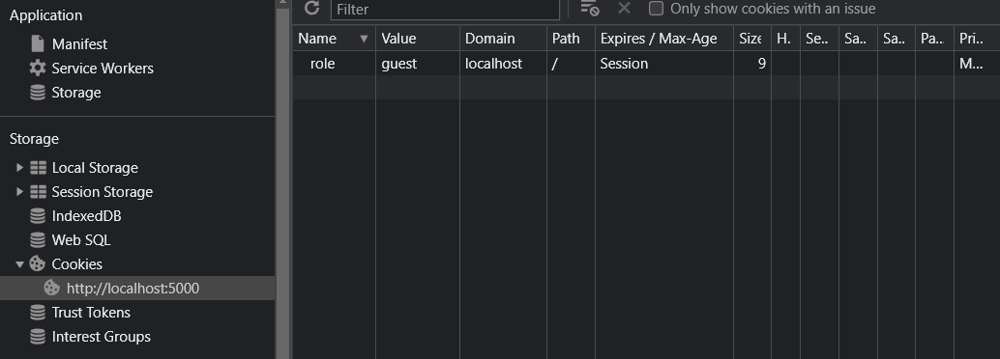
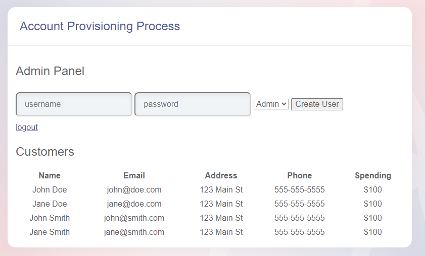

# KBID XXX - Session Management - Part 1

## Running the app

```
$ sudo docker pull blabla1337/account-provisioning-process
```

```
$ sudo docker run -ti -p 127.0.0.1:5000:5000 blabla1337/account-provisioning-process
```


Now that the app is running let's go hacking!


## Running the app Python3

First, make sure python3 and pip are installed on your host machine. After installation, we go to the folder of the lab we want to practise "i.e /skf-labs/python/Session-Management-1/ " and run the following commands:

```
$ pip3 install -r requirements.txt
```

```
$ python3 <labname>
```


Now that the app is running let's go hacking!



## Reconnaissance

Sometimes websites have protected routes that are not accessible to the public. These routes are usually used for internal purposes such as managing user accounts. In order to access these routes, one must first login with valid credentials.

The application doesn't show anything interesting at first sight. Let's try to find some hidden routes.

The file robots.txt it's used to tell search engine crawlers which URLs the crawler can access on your site. If we go to the robots.txt file we can see that there is a route called "/admin-panel/" that is not allowed to be indexed by search engines.



If we go to the route "/admin-panel/" we can see that there is a user creation form. Let's try to create a new user.



## Exploitation

When trying to create a new user, we get an error message. This is likely because we don't have the correct privileges to create a new user.

If we open the developer tools and check our cookies, we can see that there is a cookie called "role" that contains the value "guest". This cookie is likely used to determine our privileges.



Let's try to change the value of the cookie to "admin" and see if we can create a new user.

And it worked! We were able to create a new user with the role "admin".

Now that we have an admin account, we can login to the admin panel and we can see that there is more content on the page that is only visible to admins.



## Additional sources

[owasp.org | Test Account Provisioning Process](https://owasp.org/www-project-web-security-testing-guide/v42/4-Web_Application_Security_Testing/03-Identity_Management_Testing/03-Test_Account_Provisioning_Process)
