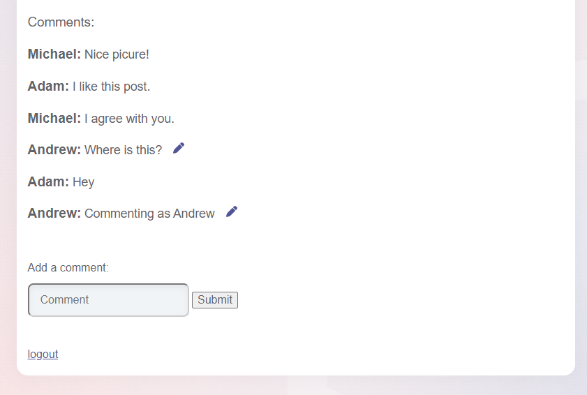

# KBID XXX - NoSQL

## Running the app

```
$ sudo docker pull blabla1337/user-registration-process
```

```
$ sudo docker run -ti -p 127.0.0.1:5000:5000 blabla1337/user-registration-process
```


Now that the app is running let's go hacking!


## Running the app Python3

First, make sure python3 and pip are installed on your host machine. After installation, we go to the folder of the lab we want to practise "i.e /skf-labs/python/SQLI-login-bypass/ " and run the following commands:

```
$ pip3 install -r requirements.txt
```

```
$ python3 <labname>
```


Now that the app is running let's go hacking!



## Reconnaissance

During the user registration process, the app should check if the username is already taken. This is a good place to start our reconnaissance. We can try to register two new users with the same name.

We can see that we were able to register both users successfully. This means that the app is not checking if the username is already taken.

## Exploitation

Now that we know that the app is not checking if the username is already taken, we can try to register a new user with the same username as an existing user.

This means that we can impersonate an existing user and post a new comment as that user.



## Additional sources

[owasp.org | Test User Registration Process](https://owasp.org/www-project-web-security-testing-guide/v42/4-Web_Application_Security_Testing/03-Identity_Management_Testing/02-Test_User_Registration_Process)
